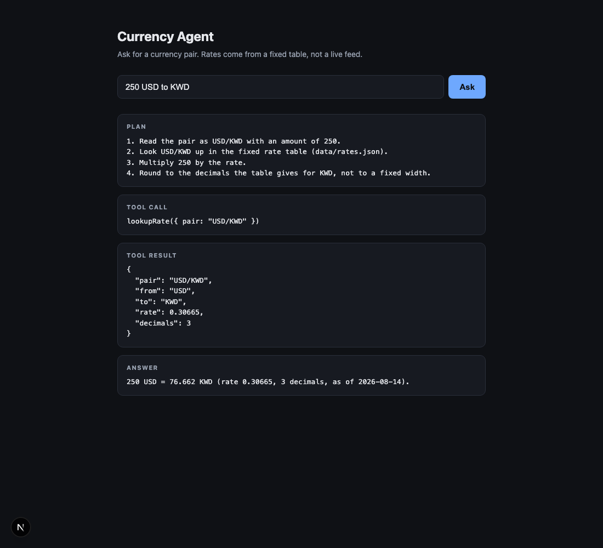

# Currency Agent Starter — Submission

- **Repo:** https://github.com/groovydhruv/currency-agent-starter
- **Initial scaffold commit:** `e7ea07059175d1e0b87f882557dd89ba00c3ecb6` (`e7ea070`, "Initial
  scaffold: Next.js App Router currency agent starter") — everything Claude Code produced from
  the instruction below landed in that commit. Anything after it is my own editing.
- **Stack:** Next.js 16 (App Router) + TypeScript, plain CSS, no other dependencies.
- **Start command:** `npm install && npm run dev` → http://localhost:3000

## Scaffold Instruction Used

The text below is the exact instruction given to Claude Code to build the starting point of
this project, copied verbatim before any edits were made to what it produced.

> Scaffold a new Next.js project using the App Router and TypeScript, in the current
> directory. It must start with a single command — tell me what that command is when you're
> done. The main page must live at `app/page.tsx`, because that is the file I am going to edit
> next.
>
> `app/page.tsx` must render a question input box and exactly four labeled blocks below it,
> labeled **Plan**, **Tool Call**, **Tool Result**, and **Answer**. Use those four words as the
> visible labels — do not substitute placeholder text like "Section 1" or lorem ipsum. The
> blocks can be empty and static for now; no interactivity, no state, no submit handler.
>
> Do not add anything else. Specifically: no database or ORM, no styling library (no Tailwind,
> no CSS-in-JS, no component kit), no authentication, no API routes, no currency conversion
> logic, no example or demo pages beyond `app/page.tsx`, no tests, and no CI config. Plain CSS
> in the default global stylesheet is fine and is all the styling I want.
>
> `.gitignore` should exclude `node_modules` and Next.js build output only. Do not add data
> files, JSON fixtures, or anything under `data/` to `.gitignore`.

### What came back, and what had to be corrected

The scaffold got the important things right: `app/page.tsx` existed, the router was the App
Router, and there was no Tailwind, ESLint config, API route, or test setup.

Three things arrived that the instruction had excluded, and were removed rather than kept:

1. A marketing demo page (`app/page.module.css` plus `public/file.svg`, `globe.svg`,
   `next.svg`, `vercel.svg`, `window.svg`) — deleted.
2. `AGENTS.md` and `CLAUDE.md`, generated automatically by Next — deleted, and
   `agentRules: false` set in `next.config.ts` so the dev server stops recreating them.
3. `next/font/google` imports in `app/layout.tsx`, which make the first render depend on a
   network fetch — replaced with a system font stack.

Everything after commit `e7ea070` is mine: the lookup logic in `app/page.tsx`, the rate table,
the per-currency rounding rule, and an optional `?q=` URL parameter that pre-fills a question
so a given lookup is linkable and reproducible.

## Rate Table

`data/rates.json` is a static fixture, not live market data. Each row carries the pair, the
`from` and `to` codes, the `rate`, and a **`decimals`** field giving the number of minor units
the target currency actually prints with.

`decimals` is the source of truth for precision — `app/page.tsx` calls
`.toFixed(entry.decimals)` and hardcodes nothing. That is what lets the same code print JPY
with no decimal places and KWD with three:

| Pair | Rate | `decimals` |
| --- | --- | --- |
| USD/JPY | 147.62 | 0 |
| USD/EUR | 0.9183 | 2 |
| USD/KWD | 0.30665 | 3 |

Full table: 14 pairs across USD, EUR, JPY, GBP, CAD, INR, AUD and KWD.

## Sample Lookup

Run with `npm run dev`, opened at http://localhost:3000. Three lookups below, chosen to show
the precision rule doing its job at 2, 0 and 3 decimals.



_Screenshot above: `docs/screenshot.png`, captured from the running dev server._

### 1. `100 USD to EUR` — two decimals

**What I typed:**

```
100 USD to EUR
```

**What the app returned:**

> **PLAN**
> ```
> 1. Read the pair as USD/EUR with an amount of 100.
> 2. Look USD/EUR up in the fixed rate table (data/rates.json).
> 3. Multiply 100 by the rate.
> 4. Round to the decimals the table gives for EUR, not to a fixed width.
> ```
>
> **TOOL CALL**
> ```
> lookupRate({ pair: "USD/EUR" })
> ```
>
> **TOOL RESULT**
> ```json
> {
>   "pair": "USD/EUR",
>   "from": "USD",
>   "to": "EUR",
>   "rate": 0.9183,
>   "decimals": 2
> }
> ```
>
> **ANSWER**
> ```
> 100 USD = 91.83 EUR (rate 0.9183, 2 decimals, as of 2026-08-14).
> ```

### 2. `2500 USD to JPY` — zero decimals

**What I typed:**

```
2500 USD to JPY
```

**What the app returned:**

> **PLAN**
> ```
> 1. Read the pair as USD/JPY with an amount of 2500.
> 2. Look USD/JPY up in the fixed rate table (data/rates.json).
> 3. Multiply 2500 by the rate.
> 4. Round to the decimals the table gives for JPY, not to a fixed width.
> ```
>
> **TOOL CALL**
> ```
> lookupRate({ pair: "USD/JPY" })
> ```
>
> **TOOL RESULT**
> ```json
> {
>   "pair": "USD/JPY",
>   "from": "USD",
>   "to": "JPY",
>   "rate": 147.62,
>   "decimals": 0
> }
> ```
>
> **ANSWER**
> ```
> 2500 USD = 369050 JPY (rate 147.62, 0 decimals, as of 2026-08-14).
> ```

No decimal point at all — the table said `0`, so the printer emitted none.

### 3. `250 USD to KWD` — three decimals

**What I typed:**

```
250 USD to KWD
```

**What the app returned:**

> **PLAN**
> ```
> 1. Read the pair as USD/KWD with an amount of 250.
> 2. Look USD/KWD up in the fixed rate table (data/rates.json).
> 3. Multiply 250 by the rate.
> 4. Round to the decimals the table gives for KWD, not to a fixed width.
> ```
>
> **TOOL CALL**
> ```
> lookupRate({ pair: "USD/KWD" })
> ```
>
> **TOOL RESULT**
> ```json
> {
>   "pair": "USD/KWD",
>   "from": "USD",
>   "to": "KWD",
>   "rate": 0.30665,
>   "decimals": 3
> }
> ```
>
> **ANSWER**
> ```
> 250 USD = 76.662 KWD (rate 0.30665, 3 decimals, as of 2026-08-14).
> ```

Three places, from the same code path that printed zero for JPY. This is the lookup shown in
the screenshot above.
